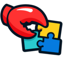

<p align="center" width="100%">
    
</p>

# Captcha Claw

A powerful [Chrome extension](https://chromewebstore.google.com/detail/captcha-claw/ahkmpdpifbekhmkfkhoeikjjggblemha) that uses OpenAI API to solve CAPTCHAs with a simple right-click.

## Features

- **Easy to Use**: Right-click on any CAPTCHA image and select "Solve captcha with captcha-claw"
- **Smart Image Extraction**: Locates images from browser resources without re-downloading
- **OpenAI Integration**: Leverages OpenAI's vision capabilities to solve CAPTCHAs
- **Multi-Provider Support**: Configure multiple API providers with automatic failover
- **Rate Limit Handling**: Automatically switches between API keys when rate limited
- **Remote Configuration**: Fetch configuration from URL for easy updates
- **Beautiful UI**: Clean popup interface with copy-to-clipboard functionality
- **Secure Storage**: API keys stored securely in Chrome sync storage

## Installation

### From Source

1. **Clone or Download** this repository to your local machine

2. **Open Chrome Extensions Page**
   - Navigate to `chrome://extensions/`
   - Enable "Developer mode" (toggle in top-right corner)

3. **Load the Extension**
   - Click "Load unpacked"
   - Select the `captcha-claw` folder

4. **Configure the Extension**
   - Click on the extension icon or right-click any image and the extension will prompt you to configure it
   - Go to extension options (right-click extension icon → Options)
   - Add your OpenAI API configuration (see Configuration section below)

## Configuration

### Basic Configuration Structure

```json
{
  "mode": "merge",
  "providers": {
    "openai": {
      "baseUrl": "https://api.openai.com/v1",
      "apiKey": "sk-your-api-key-here",
      "api": "openai-completions",
      "models": [
        {
          "id": "gpt-4o",
          "name": "GPT-4o",
          "reasoning": false,
          "input": ["text", "image"],
          "contextWindow": 128000,
          "maxTokens": 4096
        }
      ]
    }
  }
}
```

### Configuration Fields

- **mode**: `"merge"` or `"replace"` - How to merge remote config with local config
- **providers**: Object containing one or more API providers
  - **baseUrl**: API endpoint base URL
  - **apiKey**: Your API key for the provider
  - **api**: API type (usually `"openai-completions"`)
  - **models**: Array of available models
    - **id**: Model identifier
    - **name**: Display name
    - **input**: Supported input types
    - **contextWindow**: Context window size
    - **maxTokens**: Maximum output tokens

### Multiple Providers Example

```json
{
  "mode": "merge",
  "providers": {
    "openai": {
      "baseUrl": "https://api.openai.com/v1",
      "apiKey": "sk-key1",
      "api": "openai-completions",
      "models": [
        {
          "id": "gpt-4o",
          "name": "GPT-4o",
          "input": ["text", "image"],
          "contextWindow": 128000,
          "maxTokens": 4096
        }
      ]
    },
    "backup": {
      "baseUrl": "https://api.openai.com/v1",
      "apiKey": "sk-key2",
      "api": "openai-completions",
      "models": [
        {
          "id": "gpt-4o-mini",
          "name": "GPT-4o Mini",
          "input": ["text", "image"],
          "contextWindow": 128000,
          "maxTokens": 4096
        }
      ]
    }
  }
}
```

### Remote Configuration

You can host your configuration on a server and have the extension fetch it:

1. Upload your configuration JSON to a publicly accessible URL
2. In the extension options, enter the URL in the "Remote Configuration URL" field
3. Click "Test & Fetch" to verify the URL works
4. Click "Save URL"

The extension will automatically merge the remote configuration with your local configuration based on the `mode` setting.

## Usage

1. **Navigate to a page** with a CAPTCHA image
2. **Right-click** on the CAPTCHA image
3. **Select** "Solve captcha with captcha-claw" from the context menu
4. **Wait** for the result to appear in a popup (bottom-right corner)
5. **Click** the result to copy it to your clipboard
6. **Paste** the solution into the CAPTCHA input field

## Features in Detail

### Automatic Failover

When you configure multiple providers, the extension will:
- Try each provider in order
- Skip to the next provider if one fails or is rate-limited
- Show which provider successfully solved the CAPTCHA

### Configuration Management

- **Validate**: Check your configuration for errors before saving
- **Import/Export**: Save and load configurations from JSON files
- **Remote Fetch**: Update configuration from a URL without reinstalling
- **Secure Storage**: All settings synced across Chrome browsers

### Smart Image Extraction

The extension extracts images directly from the browser's cache:
- No additional network requests
- Preserves CAPTCHA session
- Handles CORS restrictions automatically

## Troubleshooting

### "No API configuration found"

- Open extension options (right-click icon → Options)
- Add at least one provider with valid API key
- Click "Validate" to check configuration
- Click "Save Configuration"

### "Failed to solve captcha"

- Check that your API key is valid
- Verify the API endpoint is accessible
- Try a different provider if configured
- Check browser console for detailed error messages

### Image extraction fails

- Some images may be protected by CORS
- The extension will attempt to fetch the image if direct access fails
- Ensure the image URL is accessible

### Rate limiting

- Configure multiple API keys in different providers
- The extension will automatically switch to the next provider
- Consider using models with higher rate limits

## Development

### Project Structure

```
captcha-claw/
├── manifest.json         # Extension manifest
├── background.js         # Service worker (handles context menu & coordination)
├── content.js           # Content script (image extraction & UI)
├── api.js              # OpenAI API handler
├── config.js           # Configuration management
├── options.html        # Options page HTML
├── options.js          # Options page script
├── styles.css          # Popup styles
└── icons/              # Extension icons
    ├── icon16.png
    ├── icon48.png
    └── icon128.png
```

### Building Icons

The extension requires icons in the `icons/` directory:
- `icon16.png` - 16x16 pixels
- `icon48.png` - 48x48 pixels
- `icon128.png` - 128x128 pixels

You can create these using any image editor. Suggested icon: A claw or eagle grabbing/solving a puzzle.

### Testing

1. Load the extension in Chrome
2. Configure your API settings
3. Find any CAPTCHA on the web
4. Right-click and test the "Solve captcha with captcha-claw" option
5. Check the console for any errors

## Privacy & Security

- **API Keys**: Stored locally in Chrome sync storage, never shared
- **Images**: Processed only by your configured API endpoints
- **No Tracking**: No analytics or data collection
- **Open Source**: All code is visible and auditable

## Requirements

- Google Chrome or Chromium-based browser
- OpenAI API key or compatible API endpoint
- Models that support vision/image input (e.g., GPT-4 Vision, GPT-4o)

## License

See LICENSE file for details.

## Contributing

Contributions are welcome! Please feel free to submit issues or pull requests.

## Disclaimer

This extension is for educational and accessibility purposes. Use responsibly and in accordance with the terms of service of websites you visit. CAPTCHAs serve important security purposes - use this tool ethically.

## Support

If you encounter issues:
1. Check the troubleshooting section above
2. Verify your configuration is valid
3. Check the browser console for error messages
4. Open an issue on GitHub with details

## Roadmap

- [ ] Support for more AI providers (Anthropic, Google, etc.)
- [ ] Batch CAPTCHA solving
- [ ] Custom prompt templates
- [ ] Usage statistics and history
- [ ] Automatic CAPTCHA detection
- [ ] Support for reCAPTCHA and other CAPTCHA types

---

Made with ❤️ for making the web more accessible
